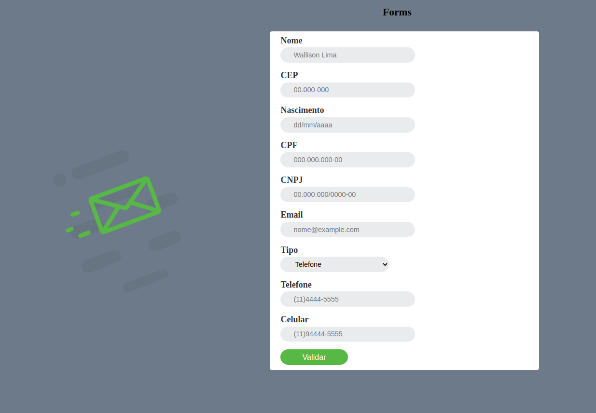

## Trabalho para entregar Fatec 2ºsemestre (Scripts)

### Desenvolver um form com os requisitos pedidos(PDF) pelo meu caro amigo Professor  ... Realizei a implementação de um servidor simples com Express para agregar valor ao trabalho.

## TESTE

* Neste projeto foi implementado JavaScript, NodeJS, HTML5 e CSS3.

Como requisito neste projeto, deve haver instalado na maquina em questão os seguinte:

* [NodeJS](https://nodejs.org/en/)
* [Git](https://git-scm.com/downloads)

e uma IDE, como estou usando o VSCode deixo também um link para download:

* [VsCode](https://code.visualstudio.com/)

Feito e instalação das ferramentas utilizadas nesse projeto, siga os passo abaixo para testar o projeto em questão:

1. Abra a IDE escolhida, no meu caso o VsCode
2. Abra um terminal na pasta do projeto(que você criou com o nome de prefência, exemplo 'ProjetoForms'), no caso do VsCode localizado na barra de tarefas, descrito como `Terminal`, `new Terminal` OU digite `CTRL + ALTgr + j`
3. [Clone](https://docs.github.com/pt/github/creating-cloning-and-archiving-repositories/cloning-a-repository#:~:text=10%2C%20done.-,Clonar%20um%20reposit%C3%B3rio%20no%20GitHub%20Desktop,Desktop%20para%20concluir%20o%20clone.) o projeto em questão.
4. Acesse a pasta clonada com `cd FormHTML`
5. Instale todas as dependências necessárias com npm: `npm install`

    5.1 Caso de erro em alguma dependência, saiba que as dependências necessárias podem ser baixadas separadamente com `npm install express`,  `npm install body-parser`

8. Feito o download corretamente de tudo, rode no mesmo terminal aberto na pasta do projeto o seguinte comando: `node server.js`

Se tudo correr bem, abra o navegador de preferência e digite na url [localhost:3000](http://localhost:3000)

Logo verá nossa aplicação rodando. Caso tenha alguma opinião em relação a melhora do processo ou implementação de algo (que com certeza haverá rsrs), deixe sua sugestão sem medo, será muito bem-vinda. Afinal sou somente um aprendiz e quero progredir com quem sabe. 

#### Obrigado!!
